# Diagramme

<strong> Goaldone Planungsalgorithmus: Gesamtüberblick (Helicopter-Ansicht)</strong>

 

Das Diagramm zeigt den vollständigen Ablauf des Planungsalgorithmus von der API-Anfrage bis zur gespeicherten Lösung. Nach dem Eingang eines Schedule-Requests werden zunächst alle relevanten Daten geladen (Arbeitszeiten, Termine, Tasks), dann validiert und in Chunks aufgeteilt. Anschließend durchläuft der CustomSolver zwei Phasen: eine Konstruktionsheuristik zur Erstellung einer Erstlösung und eine lokale Suche zur iterativen Verbesserung. Je nach Score-Ergebnis wird entweder ein vollständiger Plan persistiert oder – bei verletzten Constraints – eine Konfliktauflösung mit Nutzerfeedback eingeleitet.

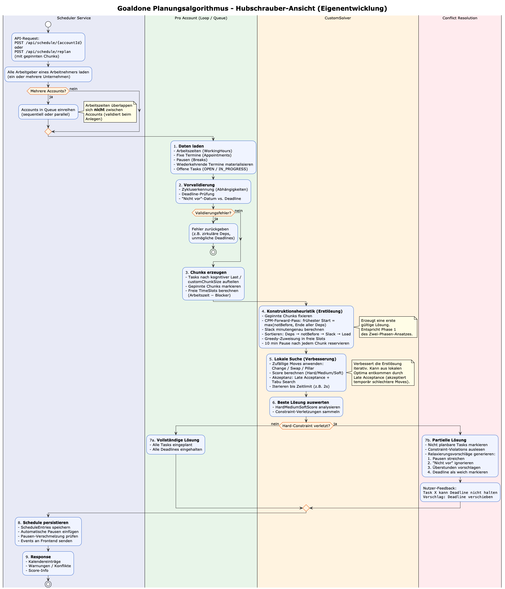

---

<strong> Datenaufbereitung & Vorvalidierung</strong>

 

Dieses Diagramm beschreibt die Schritte, die vor der eigentlichen Optimierung stattfinden. Es zeigt, wie Arbeitszeiten und fixe Termine (inkl. wiederkehrender Termine per RRule) geladen und zu freien Zeitfenstern (TimeSlots) verrechnet werden. Parallel dazu wird der Task-Pool aufgebaut, ein Abhängigkeitsgraph erstellt und auf zirkuläre Abhängigkeiten geprüft. Abschließend werden Deadlines vorab gegen die verfügbare Arbeitszeit geprüft – Tasks mit unlösbaren Deadlines werden mit einer Warnung markiert, aber trotzdem an den Solver übergeben.

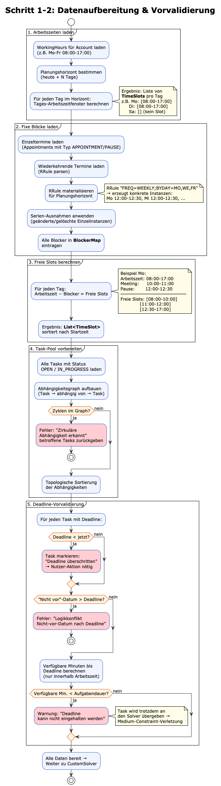

---

<strong> Domänenmodell (Custom Solver, Plain Java)</strong>

 

Das Klassendiagramm stellt das interne Datenmodell des selbst entwickelten Solvers vor. Zentrale Klassen sind TaskSchedule (die gesamte Lösung), TaskAssignment (ein eingeplanter Aufgaben-Chunk), TimeSlot (ein freies Zeitfenster), Task (die eigentliche Aufgabe) und HardMediumSoftScore (die dreigliedrige Bewertungsstruktur). Zusätzlich sind die drei Move-Typen (ChangeMove, SwapMove, PillarMove) als Interface-Implementierungen abgebildet. Ein zentraler Unterschied zum Framework-Ansatz: Pinning und Account-Validierung müssen in jeder Move-Klasse manuell implementiert werden.

---

<strong> Constraint-Evaluation (ScoreCalculator)</strong>

 

Dieses Aktivitätsdiagramm zeigt den Ablauf der imperativen Score-Berechnung. Der Calculator iteriert über alle zugewiesenen Chunks und prüft sequenziell sämtliche Hard-, Medium- und Soft-Constraints (H1–H6, M1–M3, S1–S4). Hard-Constraints schließen Zeitüberlappungen, Kapazitätsüberschreitungen, Abhängigkeitsverletzungen und Reihenfolge-Fehler ein. Medium-Constraints betreffen Deadlines und nicht eingeplante Chunks. Soft-Constraints optimieren Dringlichkeit, Pausen und Kompaktheit. Am Ende wird ein HardMediumSoftScore-Objekt zurückgegeben, das lexikographisch verglichen wird.

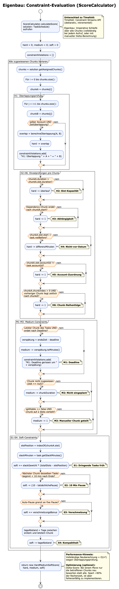

---

<strong> Constraint-Übersicht</strong>

 

Eine strukturierte Referenz-Übersicht über alle Constraints des Systems, aufgeteilt in drei Kategorien. Die Hard-Constraints (H1–H6) dürfen nie verletzt werden. Medium-Constraints erlauben suboptimale Lösungen. Soft-Constraints optimieren die Qualität des Plans.

---

<strong> Solver-Ausführung im SchedulerService</strong>

 

Das Diagramm zeigt den vollständigen Ausführungsablauf des Solvers aus Sicht des SchedulerService. Nach dem Aufbau der TaskSchedule wird der Solver gestartet. Phase 1 erzeugt eine Erstlösung, Phase 2 verbessert diese iterativ. Nach Ablauf des Zeitlimits wird der beste Plan analysiert und persistiert.

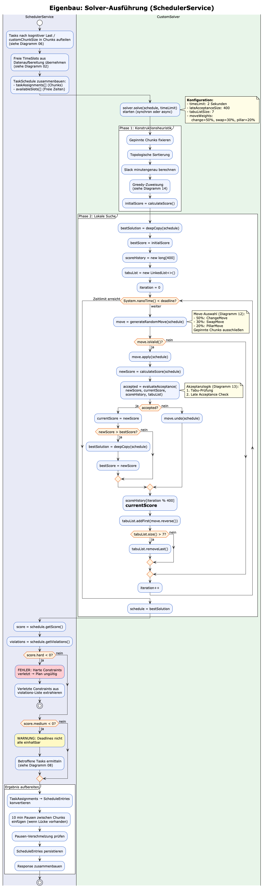

---

<strong> Chunking-Logik (Aufgabenzerlegung)</strong>

 

Dieses Diagramm erklärt, wie eine Aufgabe vor der Übergabe an den Solver in zeitliche Teilstücke (Chunks) zerlegt wird. Die Chunk-Größe hängt von der kognitiven Last ab. Nach jedem Chunk wird eine Pause als Soft-Constraint berücksichtigt.

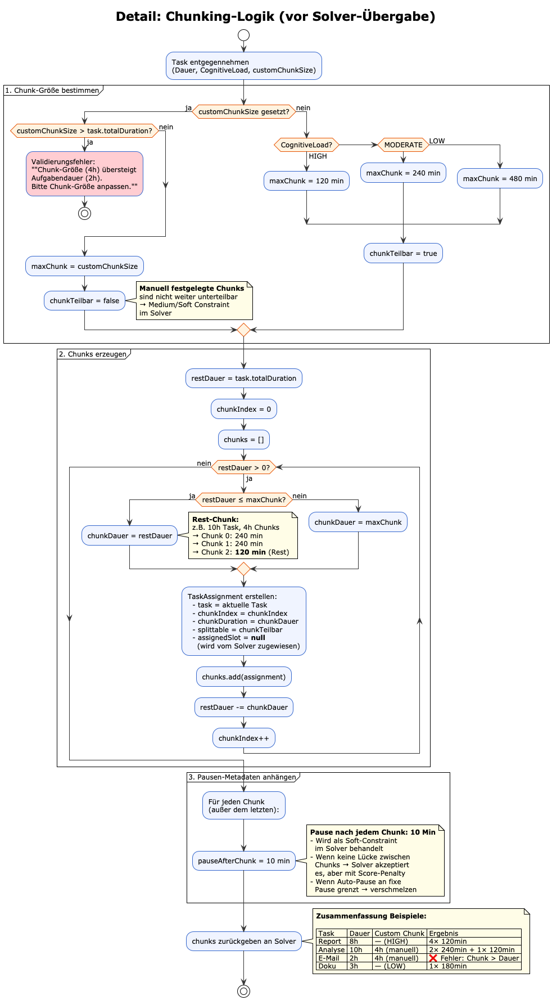

---

<strong> Multi-Account Scheduling</strong>

 

Das Diagramm beschreibt, wie das System mit mehreren Accounts umgeht. Solver-Läufe können sequenziell oder parallel erfolgen. Die Ergebnisse werden anschließend zusammengeführt.

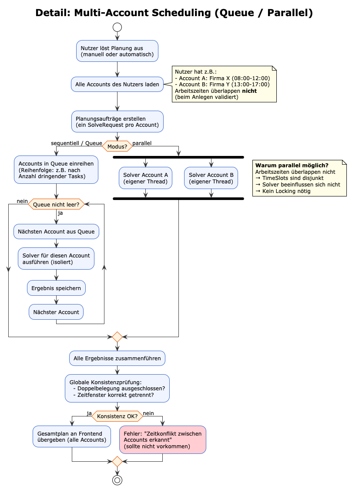

---

<strong> Konflikterkennung & Relaxierung</strong>

 

Dieses Diagramm zeigt, was passiert, wenn keine vollständig gültige Lösung gefunden wird. Constraint-Verletzungen werden analysiert und dem Nutzer konkrete Lösungsvorschläge gegeben.

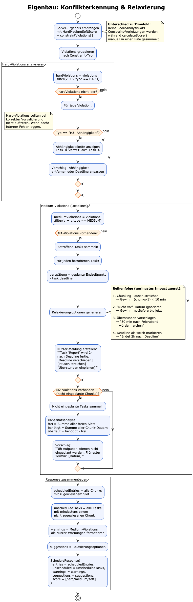

---

<strong> Aufgabe verschieben & Pinning</strong>

 

Dieses Diagramm beschreibt den Workflow beim manuellen Verschieben eines Tasks. Gepinnte Chunks werden vom Solver nicht mehr verändert.

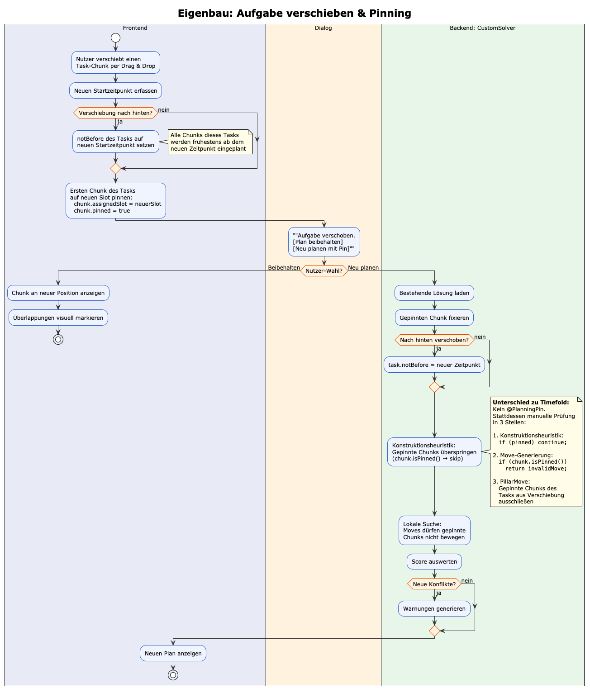

---

<strong> Eigenbau-Solver: Gesamtüberblick</strong>

 

Ein Überblick über die zwei zentralen Phasen: Konstruktionsheuristik und lokale Suche. Der Solver verbessert iterativ die Lösung.

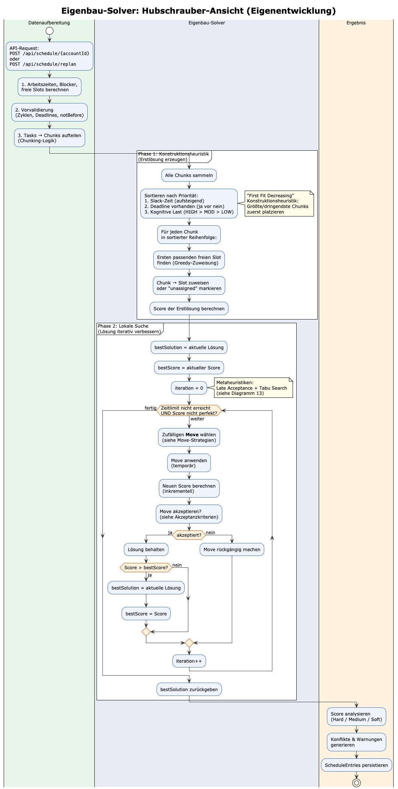

---

<strong> Score-Berechnung (HardMediumSoftScore)</strong>

 

Das Diagramm zeigt die dreistufige Score-Berechnung. Hard-Constraints haben höchste Priorität.

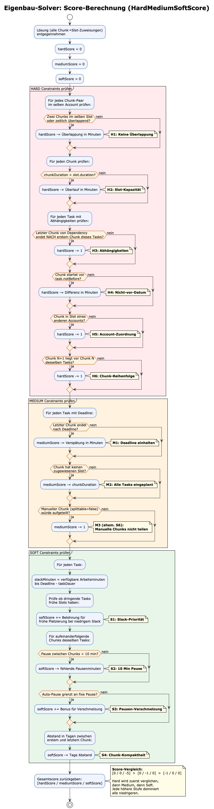

---

<strong> Move-Strategien (Nachbarschaftssuche)</strong>

 

Dieses Diagramm erklärt die drei Move-Typen: Change, Swap und Pillar Move.

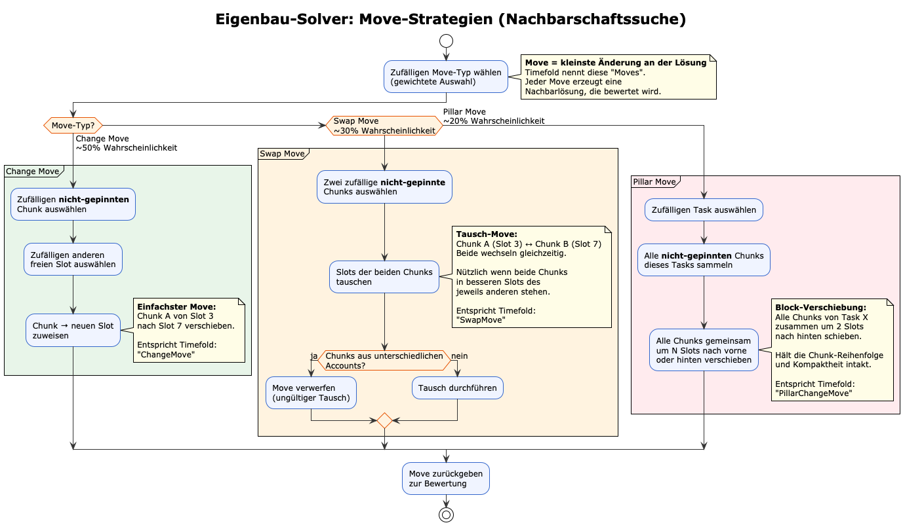

---

<strong> Akzeptanzkriterien (Late Acceptance + Tabu Search)</strong>

 

Das Diagramm zeigt, wann ein Move akzeptiert oder abgelehnt wird.

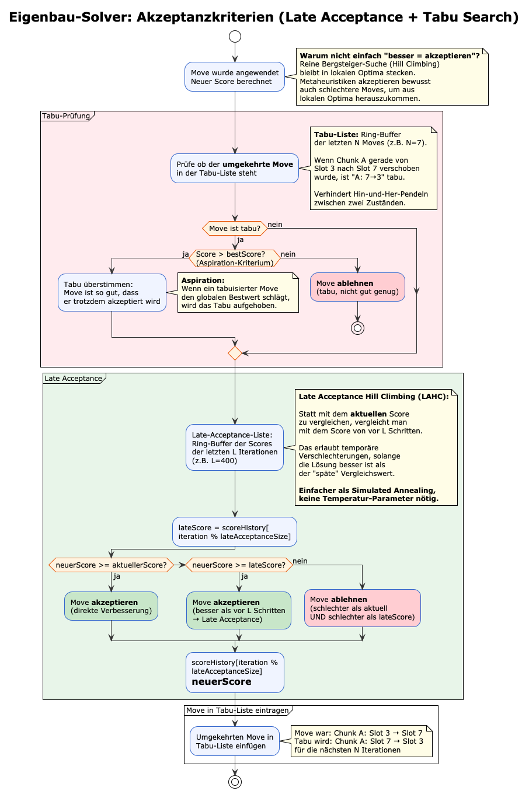

---

<strong> Konstruktionsheuristik (Erstlösung)</strong>

 

Das Diagramm beschreibt, wie die erste gültige Lösung erzeugt wird.

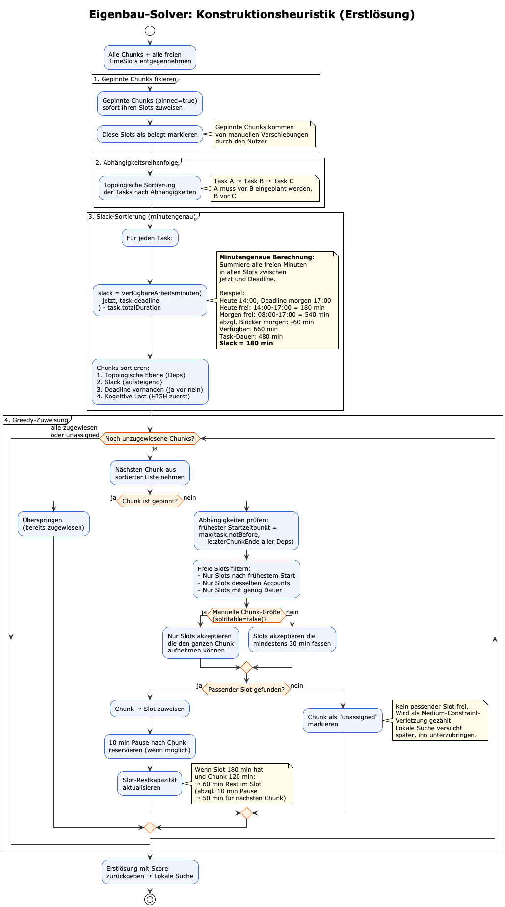

---

<strong> Vergleich: Timefold AI vs. Eigenbau-Solver</strong>

 

Vergleich zwischen Framework und Eigenbau hinsichtlich Aufwand und Funktionalität.

