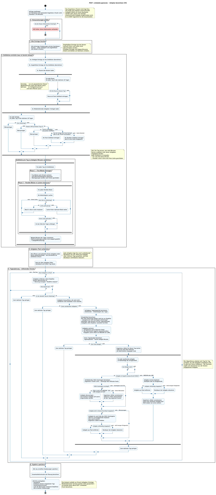
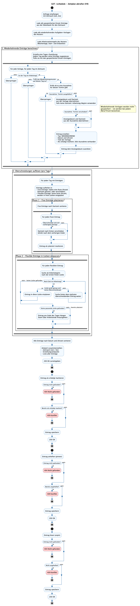

# Planungsalgorithmus

# Entwurf Stand März 2026

Ein Plan muss immer manuell generiert werden und wird anschließend in der Datenbank gespeichert.

Beim Aufruf der Planungsseite wird der aktuelle Plan abgerufen. Wiederholende Aufgaben werden dynamisch mitgeladen.

